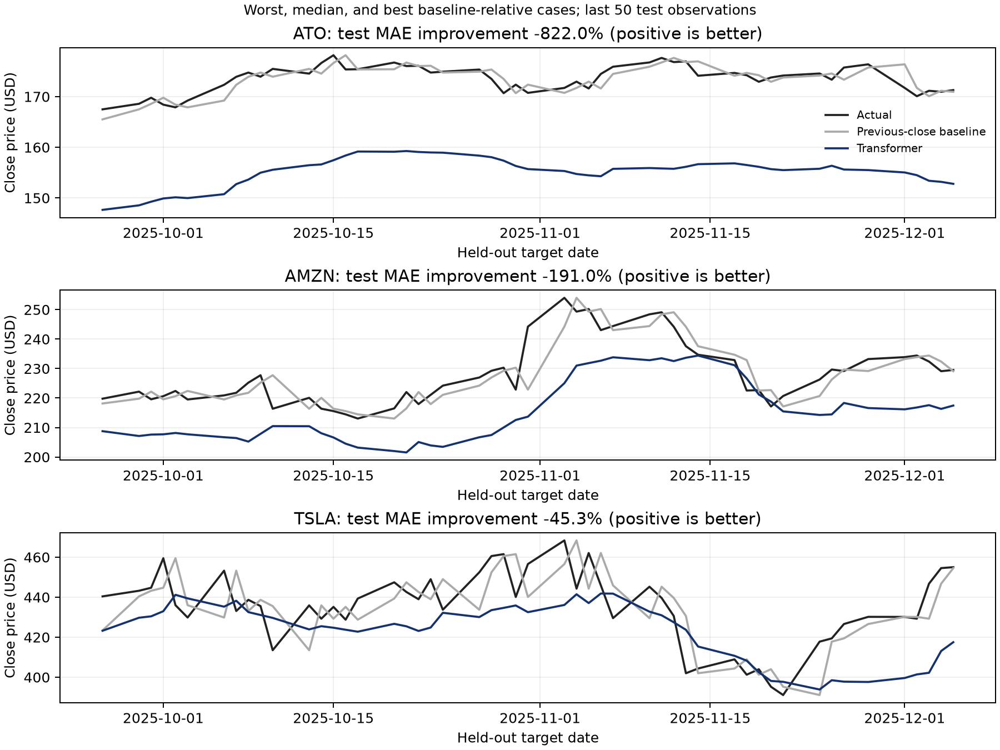

# Block by Block — reproducible financial ML evaluation

[Executed PPO notebook](../RL_model/FinRL_BlockByBlock.ipynb) · [Transformer checkpoint audit](../stock_transformer/Model_training/Transformer.ipynb)

Block by Block was built for the **AI Odyssey hackathon**. The exact edition year
is still unconfirmed; no placement is assigned to this project. These new
evaluations distinguish measured outcomes from the original prototype's ambitions.

## PPO: training and held-out evaluation

**The PPO policy was trained inside the notebook**, using Stable-Baselines3,
PyTorch CUDA and a pinned FinRL environment. It completed **1,000,448 steps**
on 25 stocks. Helper scripts execute/replay the notebook; they do not replace
the training/evaluation code shown in it.

Training dates: 2016–2022. Held-out backtest: 2023–2024. VecNormalize statistics
are learned on training and frozen on test. Transaction cost is 0.1% per trade.

| Strategy | Return | Max drawdown | Sharpe (zero risk-free) |
|---|---:|---:|---:|
| PPO | +53.15% | 8.27% | 1.515 |
| Equal-weight buy-and-hold | +80.78% | 13.47% | 1.900 |

PPO loses on return but has lower drawdown in this one run. This is not a
risk-matched comparison or robust trading evidence. A fixed-policy next-close
execution sensitivity replay returns **+53.64%**, without retraining the policy.
Saved policy + matching normalizer reproduce the original dated account series.

## Shared Transformer audit

Restore the original architecture and weights, verify available scalers against
training-only refits, and compare 37 tickers over **16,872 time-held-out windows**.
**0/37 tickers beat persistence**. Macro price-normalized MAE is **4.294% vs 1.264%**.

The original shared model aimed to transfer to unseen tickers. This audit evaluates
later dates for known stocks; the original API requires an existing ticker scaler.
Unseen-ticker generalization is not demonstrated. Training/source-selection
provenance is incomplete; pinned original training code is in `data-sources/transformer-design`.



## Reproduce the saved artifacts

From repository root, on a compatible Linux CUDA machine:

```bash
uv venv --python 3.12.13 evaluation/.venv
uv pip install --python evaluation/.venv/bin/python \
  --extra-index-url https://download.pytorch.org/whl/cu130 \
  --index-strategy unsafe-best-match -r evaluation/requirements-gpu.lock.txt
evaluation/.venv/bin/python evaluation/verify_files.py
evaluation/.venv/bin/python -m unittest discover -s evaluation/notebooks -p 'test_*.py' -v
evaluation/.venv/bin/python evaluation/replay_ppo.py
```

This loads the saved PPO model/normalizer and reproduces its historical accounts
and execution-delay audit **without training another million steps**.

To rerun the checkpoint audit:
`evaluation/.venv/bin/python evaluation/execute_notebooks.py Transformer.ipynb`.

To train a new PPO policy:
`evaluation/.venv/bin/python evaluation/execute_notebooks.py FinRL_BlockByBlock.ipynb`.
Running all PPO notebook cells trains anew. A short budget via
`PPO_TIMESTEPS` is a distinct experiment, not the included million-step result.

## Included evidence and limits

Executed notebooks, dated predictions/accounts, comparison CSVs, charts, models,
training normalizers, original data snapshots and checksum/source manifests are
included. Pinning preserves this input snapshot; refetching provider history can
change it. Vendored FinRL code retains its upstream license and source manifest.
Original model/data terms remain applicable; no ownership of third-party code/data
is claimed. Keras uses its PyTorch backend for the Transformer checkpoint audit.

One seed and one period do not establish robustness. Selected stock universe,
survivorship risk, no slippage/dividend accounting and same-close execution limit
the backtest. The optional SHAP cell remains disabled. No test-set tuning is
presented as an improvement. Saved outputs come from the completed local GPU run;
portable path/context edits were made for publication and replay-checked.
